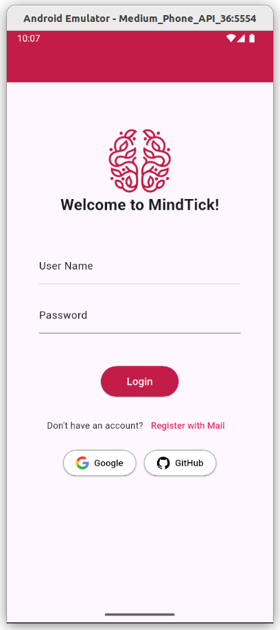
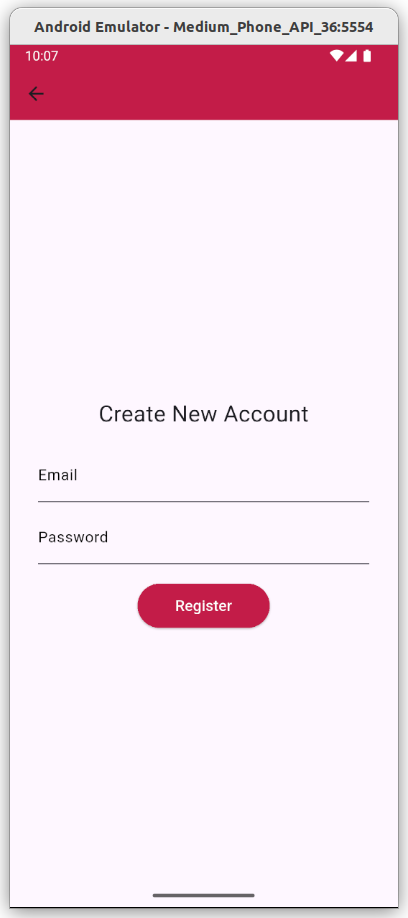
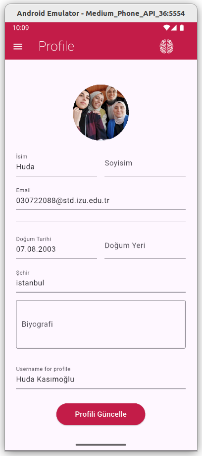
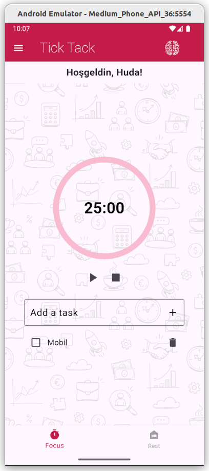
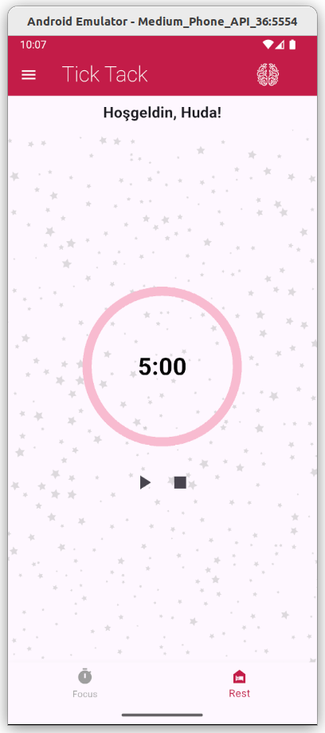
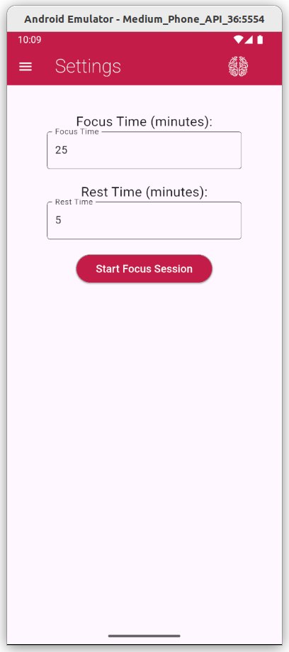

# Pomodoro Uygulaması

Pomodoro, kullanıcıların odaklanma ve dinlenme sürelerini yönetmelerine yardımcı olan, Flutter ile geliştirilmiş modern bir zaman yönetimi uygulamasıdır. Ayrıca profil yönetimi ve kullanıcı bilgilerini düzenleme özellikleri sunar.

## Projenin Amacı

Verimli çalışma için Pomodoro tekniğini kullanarak, kullanıcıların odaklanma ve mola sürelerini kolayca planlamalarını sağlamak. Aynı zamanda kullanıcıların profillerini güncelleyebilecekleri güvenli ve pratik bir arayüz sunmak.

## Teknik Detaylar

- **Flutter:** Platformlar arası mobil uygulama geliştirme.
- **Firebase:** Kullanıcı kimlik doğrulama ve temel kullanıcı verileri için.
- **Supabase:** Profil bilgileri ve profil resmi yönetimi için.
- **SQLite:** Cihaz içi veriler için hızlı ve offline depolama.
- **Provider:** Durum yönetimi.
- **Image Picker:** Kullanıcıların profil fotoğrafı seçimi için.

## Öne Çıkan Özellikler

- **Kullanıcı Girişi:** Firebase Authentication ile güvenli giriş.
- **Profil Yönetimi:** Supabase Storage kullanarak profil resmi yükleme ve güncelleme.
- **Pomodoro Zamanlayıcısı:** 25 dakika odaklanma ve 5 dakika mola süreleriyle zaman yönetimi.
- **Profil Bilgileri Güncelleme:** İsim, soyisim, biyografi, doğum tarihi ve şehir gibi bilgileri düzenleyebilme.
- **Veri Senkronizasyonu:** Firestore, Supabase ve SQLite ile verilerin senkronize edilmesi.
- **Tema Yönetimi:** Karanlık ve açık mod seçenekleri.
- **Google ve GitHub OAuth:** Alternatif hızlı giriş yöntemleri.

## Kullanılan Teknolojiler

- Flutter  
- Firebase (Authentication, Firestore)  
- Supabase (Storage ve Veritabanı)  
- SQLite (Yerel veri)  
- Provider (State Management)    

## Uygulama Sayfalarının Görevleri ve İçerikleri

### 1. Giriş Sayfası (`login.dart`)

- E-posta ve şifre ile giriş yapma.
- Google ve GitHub OAuth ile alternatif giriş.
- Kayıt olma ve şifre sıfırlama seçenekleri.
- 

### 2. Kayıt Sayfası (`register.dart`)

- E-posta, şifre ve kullanıcı adı ile yeni hesap oluşturma.
-  

### 3. Profil Sayfası (`profil.dart`)

- Kullanıcı bilgilerini görüntüleme ve düzenleme.
- Profil fotoğrafı seçip Supabase Storage’a yükleyebilme.
- Profil bilgilerini Firebase, Supabase ve SQLite ile senkronize etme.
-  

### 4. Ana Sayfa (`home.dart`)

- Pomodoro zamanlayıcısı başlatma ve durdurma.
- Odaklanma ve dinlenme sürelerini gösterme.
- 
- 

### 5. Ayarlar Sayfası (`settings.dart`)

- Pomodoro zamanlayıcısı ayarları değiştirme.
- 

## Login Bilgilerinin Saklanması

- **Firebase E-posta:** hudaahmad0708@gmail.com  
- **Firebase Şifre:** 123456 

Kullanıcı giriş bilgileri Firebase Authentication kullanılarak güvenli bir şekilde saklanmaktadır:

- Kullanıcı, e-posta ve şifre ile giriş yaptığında bilgiler Firebase Authentication'a gönderilir.
- Firebase, kullanıcı bilgilerini kendi güvenli veritabanında saklar.
- Başarılı giriş sonrası, oturum belirteci (token) uygulamada saklanır ve API isteklerinde kullanılır.
- Hassas bilgiler (şifre vb.) cihazda saklanmaz, tüm kimlik doğrulama Firebase tarafından yönetilir.

## Grup Üyelerinin Projeye Katkısı
**Huda Kasımoğlu**
- Projedeki her şeyden sorumlu.

  
